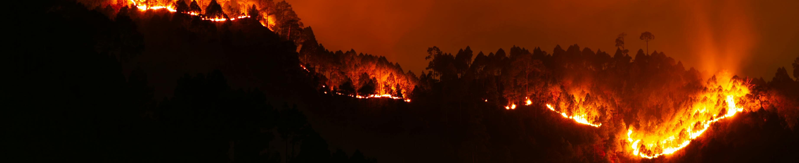

<h1>Fire Risk Predictor – Predicting Time-to-Threat for Evacuation Zones Using Survival Analysis</h1>

   

<h3>Context</h3>
When a wildfire ignites, emergency responders face important questions with very little time to answer them:
<ul>
  <li>Which fires will reach populated areas?</li>
  <li>How quickly will those fires reach those areas?</li>
  <li>Which communities should prepare for the possibility of a wildfire reaching them first?</li>
</ul>
Existing forecasting approaches often reduce this problem to the simple question of "will this fire become dangerous?", ignoring information about when and relative to what other fires that emergency responders need in the event of a wildfire spread. Evacuation decisions in the real world are <b>time bound, comparative</b> and <b>made under uncertainty</b> about the progression of events. 
<h3>Problem Task</h3>
This project builds a survival model that answers these questions using only the earliest signals available. 
<ul style="font-size: 18px">
  <li>The model is to predict the probability that a wildfire will threaten an evacuation zone within 12, 24, 48, and 72 hours, drawing on data from just the first five hours after ignition.</li>
  <li>These probabilities will provide emergency responders with the information to make decisions that prioritise the right evacuation zones, by knowing which fires are more likely to get within a dangerous proximity of a populated area and within how many hours they will do so.</li>
</ul>
<h3>Dataset: WiDS Global Datathon 2026</h3>
<h4>Features</h4>
The dataset consisted of features pertaining to:
<ul>
  <li>Temporal coverage: e.g. <code>num_perimeters_0_5h</code>, <code>dt_first_last_0_5h</code></li>
  <li>Growth features: e.g. <code>log1p_area_first</code>, <code>area_first_ha</code>, <code>area_growth_abs_0_5h</code></li>
  <li>Centroid Kinematics: e.g. <code>centroid_displacement_m</code>, <code>spread_bearing_sin</code></li>
  <li>Distance to evacuation zone centroids: e.g. <code>dist_min_ci_0_5h</code>, <code>closing_speed_m_per_h</code></li>
  <li>Directionality: e.g. <code>alignment_abs</code></li>
  <li>Temporal metadata: e.g. <code>event_start_hour</code></li>
</ul>
<h4>Targets</h4>
<li><code>time_to_hit_hours</code>: Time from first five hours until fire comes within 5 km of an evac zone (hours). For censored events (never hit within 72h), this is the last observed time within the 72 hour observation window.</li>
<li><code>event</code>: Binary indicator where 1 if fire hits within 72 hours and 0 otherwise.</li>
<h4>Size</h4>
<ul>
  <li><code>train.csv</code>: 221 rows</li>
  <li><code>test.csv</code>: 95 rows</li>
</ul>
<h3>Modelling Approach</h3>
<h4>Model of choice</h4>
The <b>Cox Proportional Hazards</b> model was used for the following reasons:
<ul>
  <li>All features within the dataset, excluding <code>log1p_area_first</code> satisfied the <b>Proportional Hazards Assumption</b> necessary for the model to work.</li>
  <li><b>The training dataset was small in size</b> (221 rows) which meant that more advanced models such as <b>Random Survival Forest</b> would be <b>more susceptible to overfitting</b>.</li>
</ul>
<h4>Feature engineering</h4>
<ul>
  <li>Our best performing model utilised only <b>three</b> features from the dataset: <code>cross_track_component</code>, <code>num_perimeters_0_5h</code> and <code>dist_min_ci_0_5h</code>.</li>
  <li>An engineered feature using <code>num_perimeters_0_5h</code> and <code>dist_min_ci_0_5h</code> was used alongside <code>cross_track_component</code></li>
</ul>
<h3>Metrics For Measuring Performance</h3>
The competition used a weighted combination of two metrics. The Concordance Index measures how well the model ranks wildfires by relative risk. The Brier Score measures probability calibration — when the model predicts a 70% threat probability, fires should actually threaten communities around 70% of the time. Together they ensure the model is both accurate in urgency rankings and trustworthy in its probability estimates.
<h3>Results</h3>
<ul>
  <li>The best performing model achieved a score of 0.92571 on the competition leaderboard, indicating good relative ranking of wildfires and calibration of risk probabilities.</li>
  <li>This means the model simultaneously ranks at-risk evacuation zones in the correct order the vast majority of the time, <b>and</b> produces well-calibrated survival probabilities.
  <li>Thus, when the model claims that a zone has a 70% chance of remaining safe within 24 hours, that estimate is close to reality.</li>
  <li>The heavy weighting on calibration (70% of the score) makes this the harder of the two components to optimise, and this particular part was addressed by the <b>Platt Scaling</b> probability calibration method, which together with the optimal set of features produced the best performing model yet.</li>
</ul>
<h3>Limitations</h3>
<ul>
  <li>Due to the very small amount of training data provided (221 rows), overfitting was a significant problem. This issue made it difficult to choose more advanced machine learning models such as the Random Survival Forest.</li>
  <li>This <b>sparsity</b> made it difficult to use more features in the Cox Proportional Hazards Model due to the <b>lack of meaningful information</b> from them.</li>
  <li>Due to the very small time horizon spanned by the training data (5 hours), <b>most features were sparse</b>, containing over 75%+ of entries as 0 for most features.</li>
  <li>Training data did not provide any data for observations around the 72 hour mark (the latest was 67 hours), which forced us to consider <b>extrapolating</b> probabilities and calibrations.</li>
  <li>Training data was not significantly reflective of the nature of the testing data.</li>
</ul>
<h3>Possible improvements/additions</h3>
<ul>
  <li>Using data from other sources such as weather databases or other datasets in general can provide greater insight into how wildfires behave.</li>
  <li>Having a larger dataset can greatly help a model reduce overfitting on a small training set, as was a common challenge during this project.</li>
</ul>
<h3>Conclusion</h3>
<ul>
  <li>This project demonstrates that meaningful wildfire threat predictions are achievable using only the first five hours of ignition data, as indicated by the optimal model's score of 0.92571.</li> 
  <li>While the dataset is small and findings should be validated at greater scale, the results suggest survival analysis is a promising framework for time-sensitive emergency response problems.</li>
  <li>With more data, more advanced survival analysis models that risk overfitting on smaller datasets, such as Random Survival Forests, can potentially provide more accurate predictions and risk rankings that give emergency responders more confidence in decision making.</li>
</ul>
